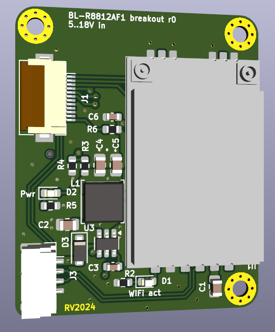

# BL-R8812AF1 (RTL8211AU) module breakout

Features:
* 5..18V power input
* JST GH for USB/power
* 12pin FFC connector (pinout for IVG-G3S / GK7205V210+IMX307) camera module- USB, microSD slot (optionally: power)

Current state: __not tested!__
